## Objective {.smaller}

📅 Temporal patterns — when people ride

👥 User behavior — members vs. casual riders

🚲 Trip characteristics — duration and distance

📍 Spatial patterns — popular stations, routes, and neighborhoods

🌦️ Weather impact — how weather relates to ridership

📊 Actionable insights — support better bike-sharing planning

---

## Tech stacks {.smaller}

- CSV data 
- API
- Python pandas, plotly

## Dataset {.smaller}

- Citi Bike trip data (2025)
- Jersey City weather data
- Jersey City neighborhoods

## Data Visualisation ???  {.smaller}

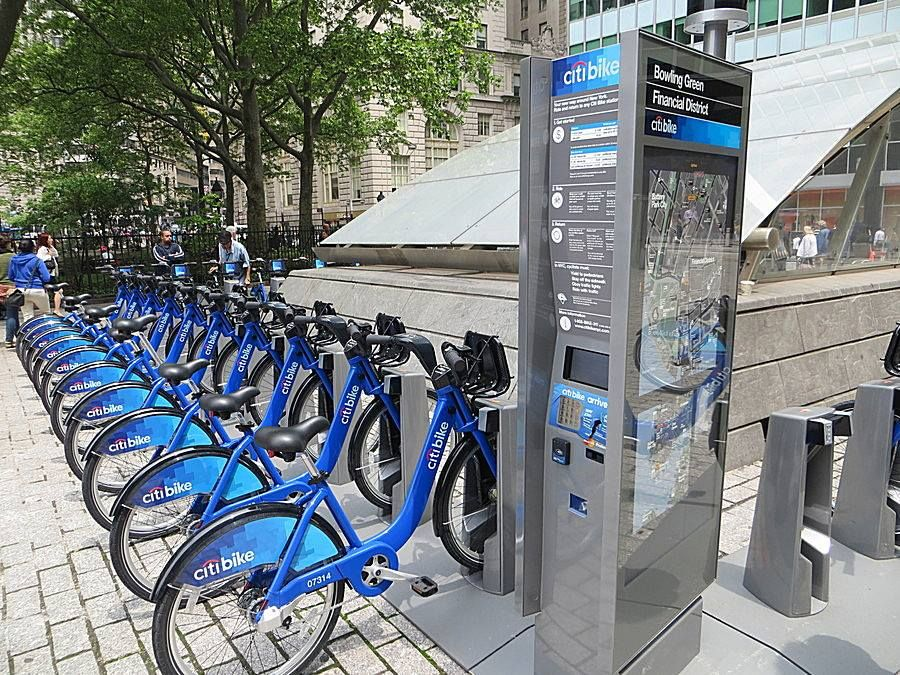{width=100%}

## Number of Rides per Season  {.smaller}

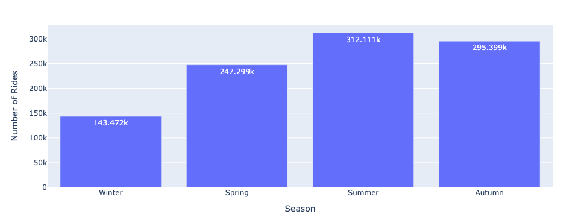{width=80%}

## Number of Rides per Month  {.smaller}

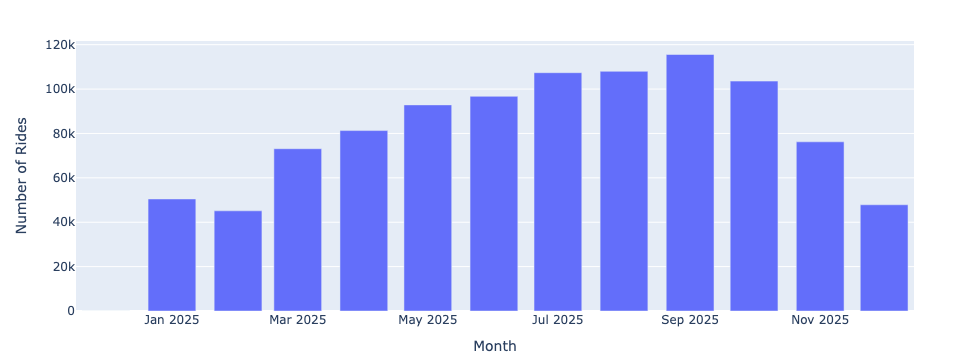{width=80%}

## Top Month  {.smaller}

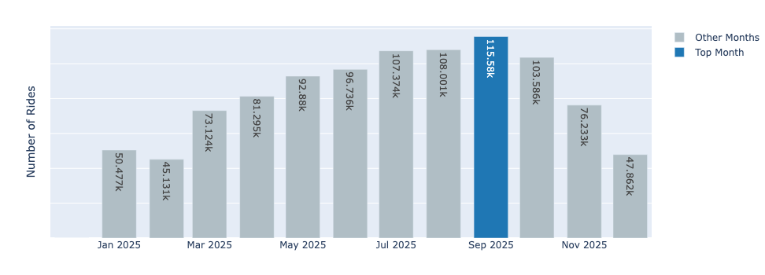{width=80%}

## Highest and Lowest Days  {.smaller}

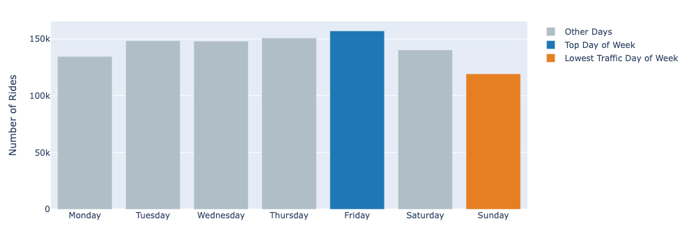{width=80%}

## Number of Rides per Time of Day  {.smaller}

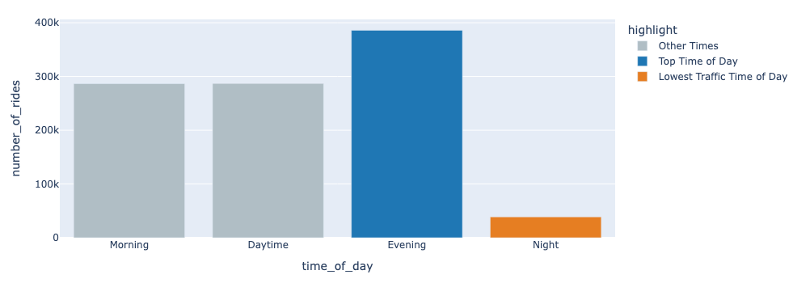{width=80%}

## Daily Rides vs Average Temperature  {.smaller}

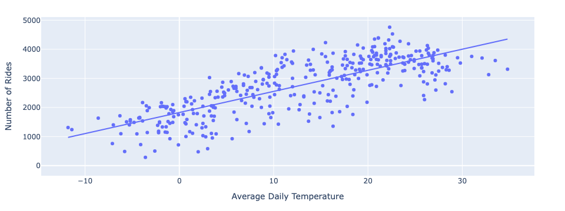{width=80%}

## Daily Rides vs Maximum Wind Speed  {.smaller}

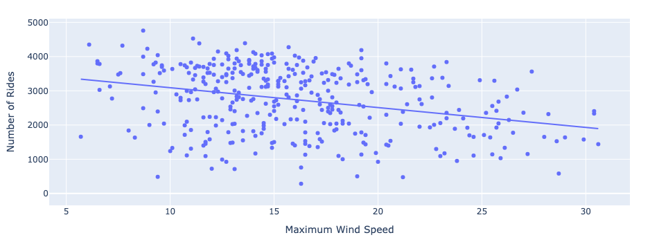{width=80%}

## Daily Rides vs Precipitation {.smaller}

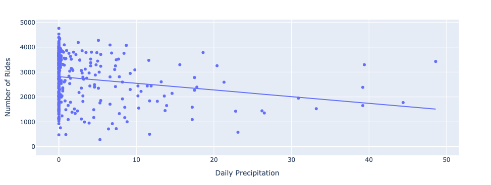{width=80%}

## Daily Rides vs. Temperature and Wind Speed {.smaller}

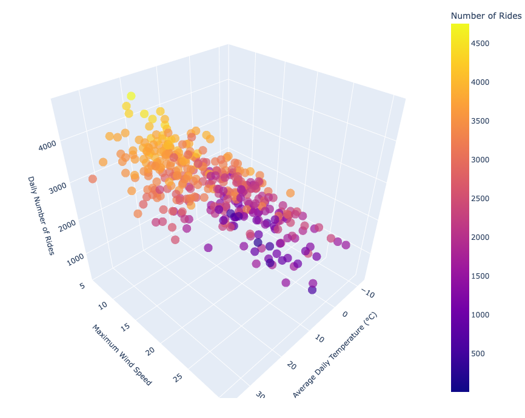{width=80%}

## Daily Rides vs. Temperature and Precipitation {.smaller}

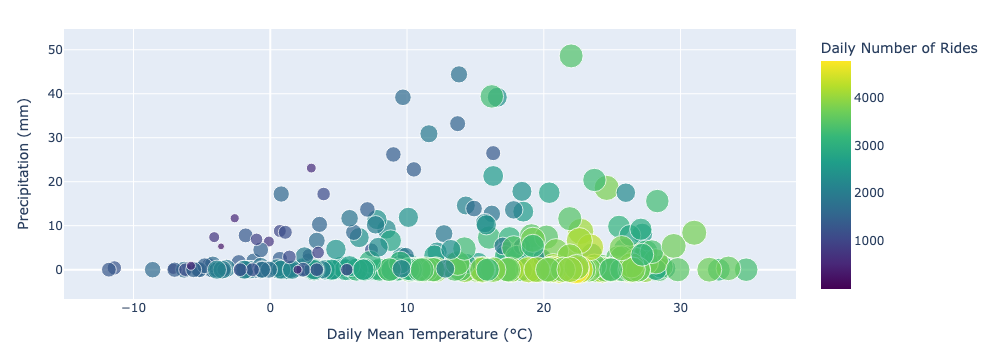{width=80%}

## Daily Rides and Daily Average Temperature {.smaller}

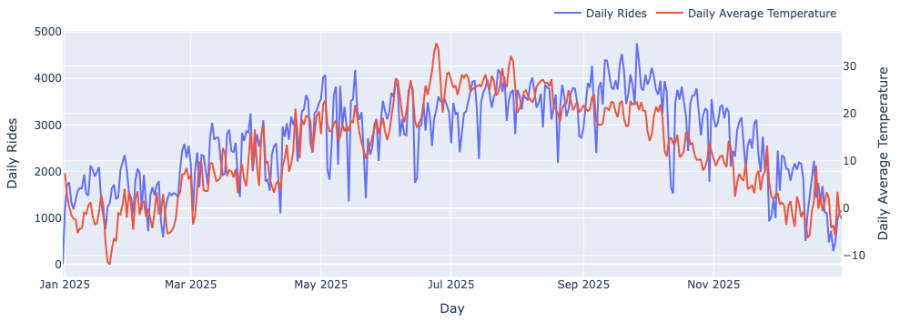{width=80%}

## Top 10 Start Stations by Number of Departures {.smaller}

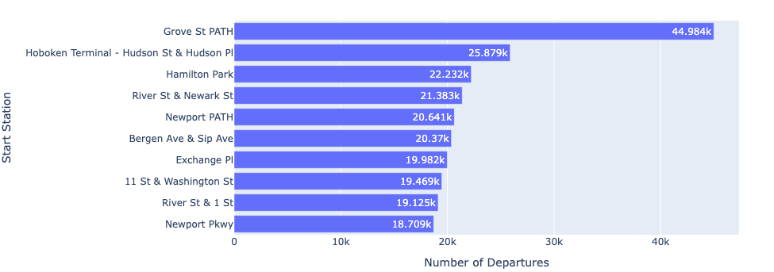{width=80%}

## Top 10 End Stations by Number of Arrivals {.smaller}

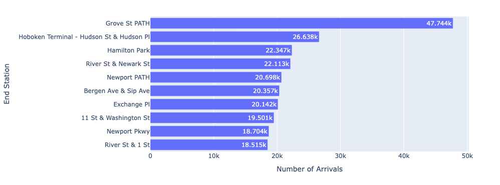{width=80%}

## Top Lines {.smaller}

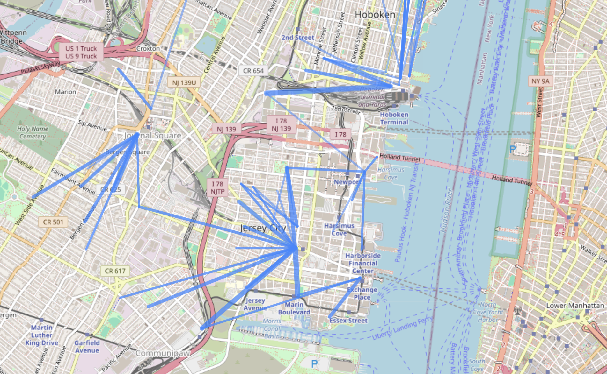{width=80%}

## Station Point {.smaller}

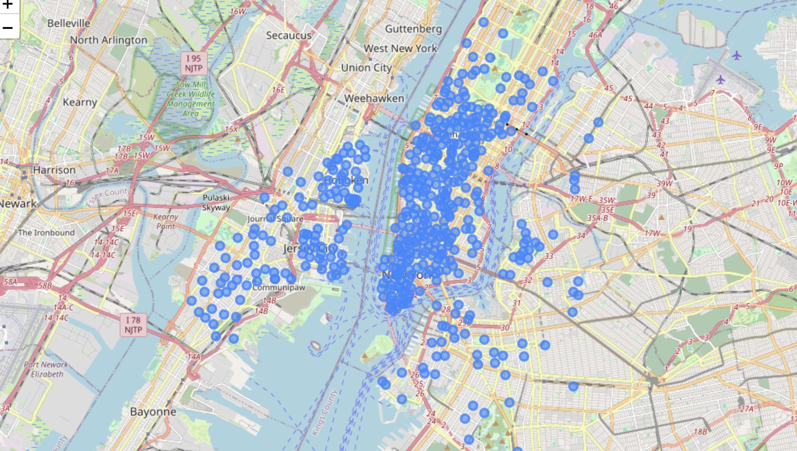{width=80%}

## Total Activity {.smaller}

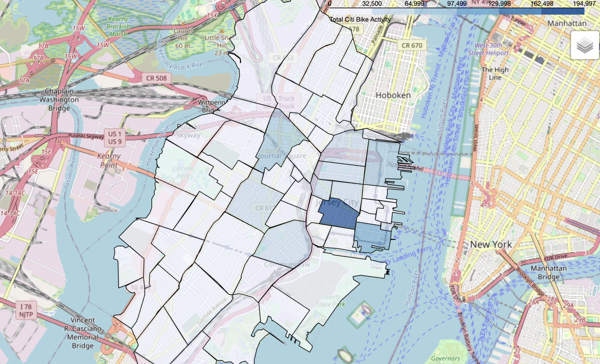{width=80%}

## Station Count {.smaller}

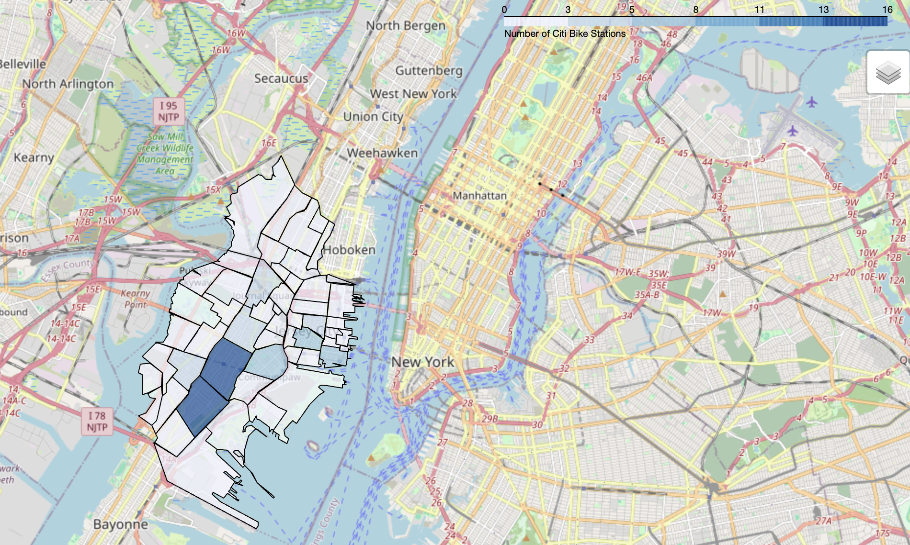{width=80%}

## Average Activity per Station {.smaller}

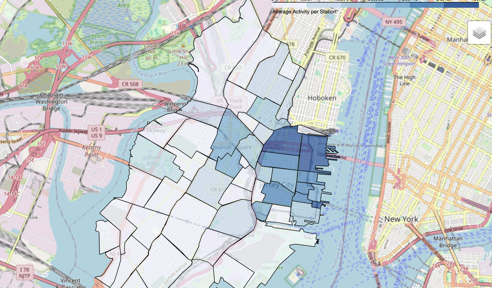{width=80%}

## Total Departures {.smaller}

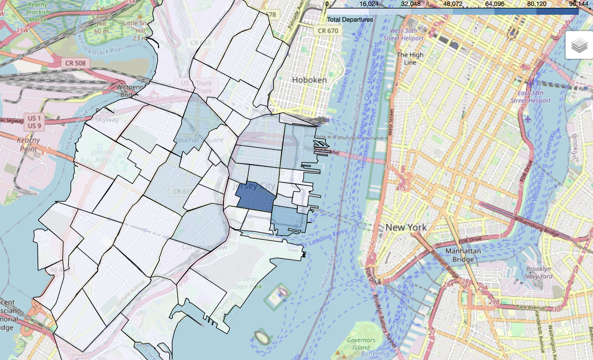{width=80%}

## Total Arrivals {.smaller}

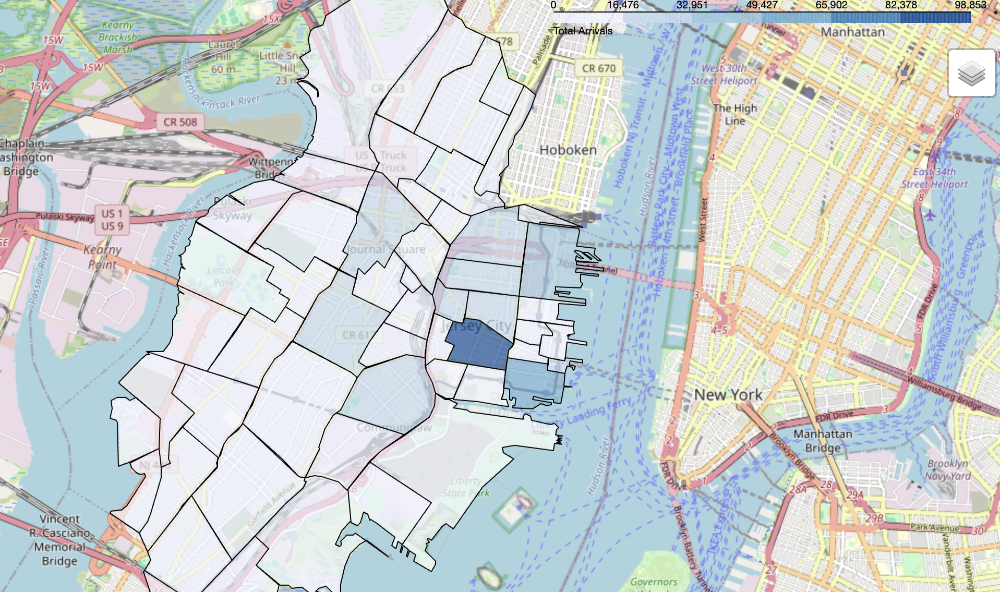{width=80%}